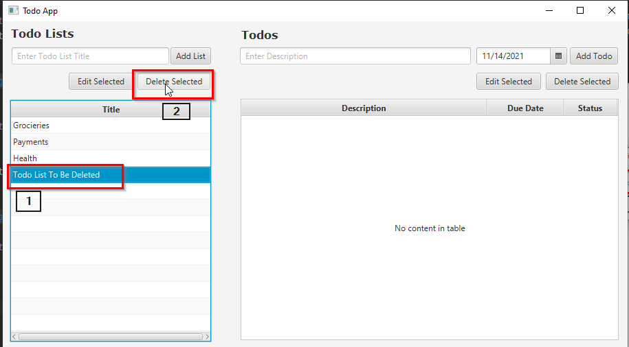
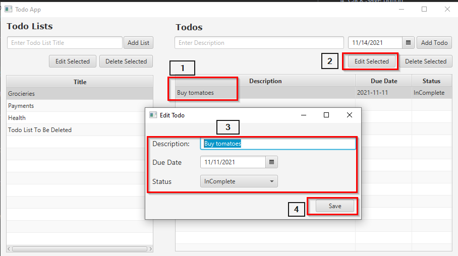

# Todo App User Guide

## Todo List Management

### How to add todo list?
1. Type the title of the todo list
2. Click "Add List" button

### How to edit a todo list?
1. Click on the todo list item that you want to edit from the todo list table.
2. Click "Edit Selected" button above todo lists table.
3. Edit the title text.
4. Click Save button.

### How to delete a todo list?
1. Click on the todo list item that you want to delete from the todo list table.
2. Click "Delete Selected" button above todo lists table.

## Todo Management

### How to add a todo in a todo list?
1. Click on the todo list item that you want to add new todo.
2. Enter todo description
3. Select due date
4. Click "Add Todo" button 

### How to edit a todo item?
1. Click on the todo item that you want to edit from the todo table.
2. Click "Edit Selected" button above todo table.
3. In the Edit Todo dialog you can edit the description, due date, and the status of the todo item.
4. Click Save button.

### How to delete a todo?
1. Click on the todo that you want to delete from the Todos table.
2. Click "Delete Selected" button above Todos table.
